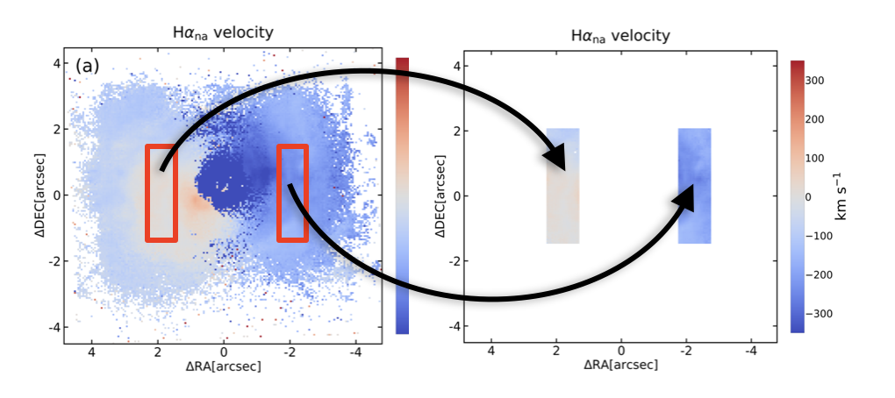
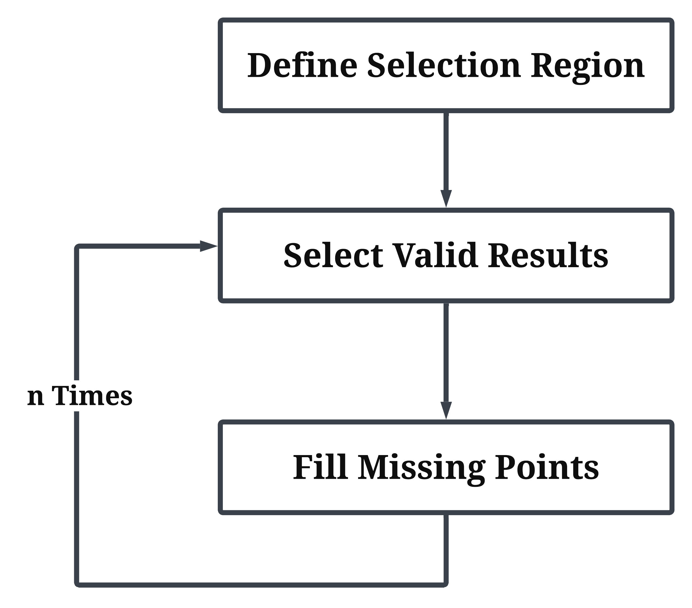
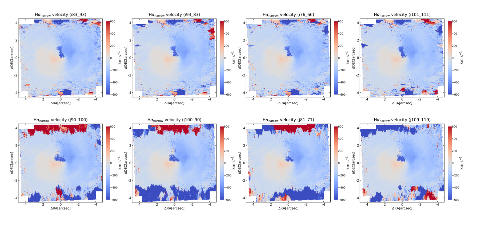
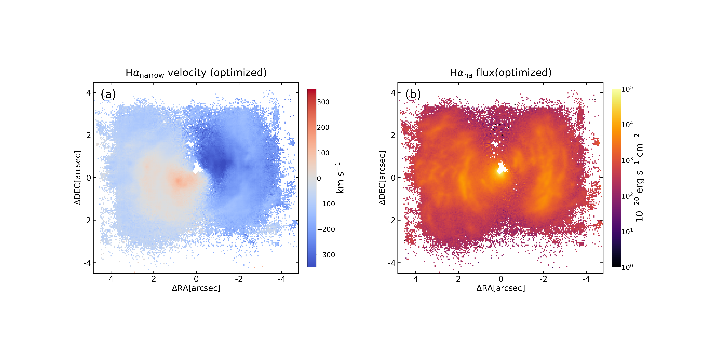

.. include:: include/links.rst

.. highlight:: python
   :linenothreshold: 3

Select the Best Fitting Results
=====================================
After following the procedure in :ref:`fit`, each spectrum of the IFS data will have a fitting result. 
By changing the function parameters, different fitting results can be obtained. In this section, 
we provide a method for selecting different fitting results. The general workflow is as follows.

Define Selection Region
------------------------

In the initial velocity map of the :math:`\text{H}\alpha` narrow component, the user selects regions where the fitting 
results are relatively smooth and physically plausible. After removing points with sudden velocity changes, 
these selected points are used as the initial reference. Here is a schematic illustration of the selected regions.

    Schematic illustration of the selected regions

The median of the velocity broadening of the :math:`\text{H}\alpha` narrow 
component in these points is taken as ``sigma0``.

Select Valid Results
----------------------

For each set of emission line fitting results, if the difference between the velocity of the :math:`\text{H}\alpha` narrow component and the 
initial velocity map is within the range of ``f1*sigma0``, and the velocity broadening of the :math:`\text{H}\alpha` narrow component is 
less than ``f2*sigma0``, it is selected; otherwise, it is excluded. Here, ``f1`` and ``f2`` are user-defined parameters. If multiple results 
are selected for a single pixel, the one with the smallest sum of absolute differences from the surrounding results, i.e., the one with the 
most continuous fitting, is automatically chosen.

Fill Missing Point
-------------------

After obtaining the first round of selected results, these results are used as the basis for further selection. For points that are not 
selected, if more than three surrounding points are selected, the median of the surrounding velocity values is taken as the basis for 
selection.

Repeat
-----------

Repeat steps **Select Valid Results** and **Fill Missing Point** until the set number of iterations is reached. In this way, the result 
obtained for each pixel is considered spatially continuous.

    Selection flowchart

|

-------

|

As before, we continue to use *MR 2251−178* as an example. The following panels show the results obtained from different fitting strategies, 
along with the selected results based on the methods described above.
It can be seen that the fitting results are not only smoother above and below the target source, but also significantly 
improved in the central region near the source.

    Results obtained from different fitting schemes

    The results selected using the above procedure

Code
-------

The Jupyter notebook used to select the fitting results in this example is provided here for reference.

* `Fitting Results Selection example <select.ipynb>`_ (:download:`Jupyter notebook <select.ipynb>`)

