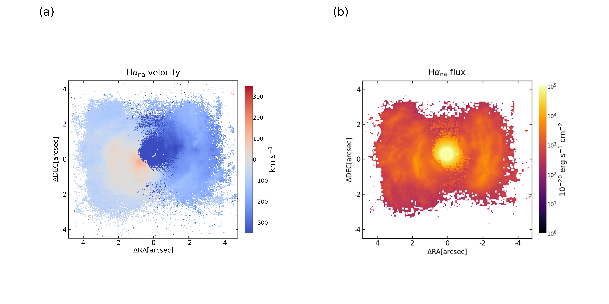
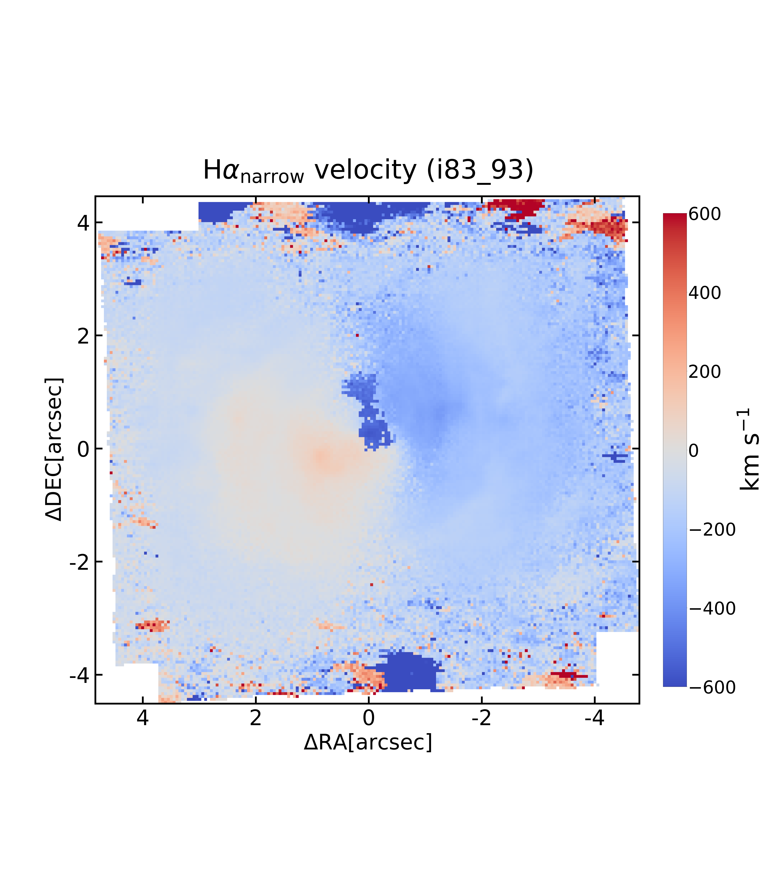

.. include:: include/links.rst

.. highlight:: python
   :linenothreshold: 3

.. _fit:

Quick Start Guide
====================

Installation
-------------

**csst-ifs-elfo** can be installed as follows:

.. code-block:: console

  git clone https://csst-tb.bao.ac.cn/code/csst-pipeline/ifs/csst_ifs_elfo.git
  cd csst-ifs-elfo
  python -m pip install .

Prepare the IFS data
----------------------
The IFS simulated observation data from CSST can be downloaded from the following link: `Download <http://202.127.29.3/~shen/NGC3359/>`_.

Import Required Modules and Functions

--------------------------

Import the  functions from **csst-ifs-elfo** to perform the fitting:

   
.. code-block:: python

  from elfo import process_i_refit
  from elfo import process_j_refit

.. note:: 
  Both functions share the same fitting logic, fitting the spectra column by column.  
  The only difference lies in the direction of progression  ``process_i_refit`` proceeds along rows,  
  while ``process_j_refit`` proceeds along columns.

The fitting of the IFS data is performed using the two imported functions. 
In the following, we take ``process_i_refit`` as an example, which fits all spectra using the fitting results of adjacent rows.  
For a detailed description of the fitting strategy, see the :ref:`workflow` section below, where we explain how ELFO's ``process_i_refit`` 
function specifically fits the IFS data.

**Parameters**

- ``i_1``: The starting row index for the first fitting. Type: ``int``.
- ``i_2``: The starting row index for the second fitting. Type: ``int``.
- ``fits_file``: The path to the input FITS file. Type: ``str``.
- ``z``: Redshift of the target object. Type: ``float``.
- ``scale_factor`` *(optional)*: The scale factor for rebinning the IFU spectra. Default is ``1``. Type: ``int``.
- ``flux_cube_path`` *(optional)*: The file path to the flux cube of the IFU data. (for pre-binned spectra)Default is ``None``. Type: ``str``.
- ``var_cube_path`` *(optional)*: The file path to the variance cube of the IFU data. (for pre-binned spectra)Default is ``None``. Type: ``str``.
- ``format`` *(optional)*: The format of the input FITS file. Default is ``'muse'``. Type: ``str``.

**Returns**

- ``str``: The path to the output directory where the results are saved.

Set up the model input parameters
----------------------------------
See an example in the `PyQSOFit`_ documentation.

Run the Fitting
----------------

**Usage Example**

Once the IFS data is ready and the functions are imported, we can run the fitting.

.. code-block:: python

    path_out = process_i_refit(i_1=30, i_2=20, fits_file='CSST_IFS_CUBE.fits', z=0.003373, format='csst')
    # Using optional parameters for custom flux/var cubes and scale factor (for pre-binned spectra)
    path_out = process_i_refit(i_1=80, i_1=90, fits_file='example.fits', z=0.02, scale_factor=2, flux_cube_path='reduced2_flux.npy', var_cube_path='reduced2_var.npy', format='csst')

The function will automatically save the fitting results to the returned path (``path_out``).  
For each spectrum,  `PyQSOFit`_ generates a ``.fits`` file with parameters and a ``.pdf`` showing the fitting result.
More details on the fitting process can be found in the :ref:`workflow` section below.

|

----------

|

Here is an example using MUSE spectral fitting of the quasar *MR 2251−178* to demonstrate the improvement 
brought by **ELFO** in emission-line fitting. The upper panel shows the velocity and flux maps of the :math:`\text{H}\alpha` narrow 
component obtained by fitting each spectrum individually using the default initial parameters in `PyQSOFit`_. 
In contrast, **ELFO** utilizes the best-fitting result from neighboring points as the initial guess for each fit. 

    The result obtained by fitting each spectrum with the default parameters

    The result obtained by using the best fit from neighboring points as the initial guess for each spectrum.

