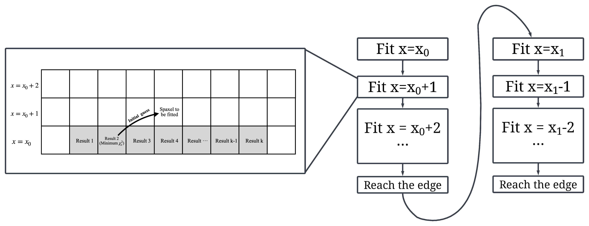
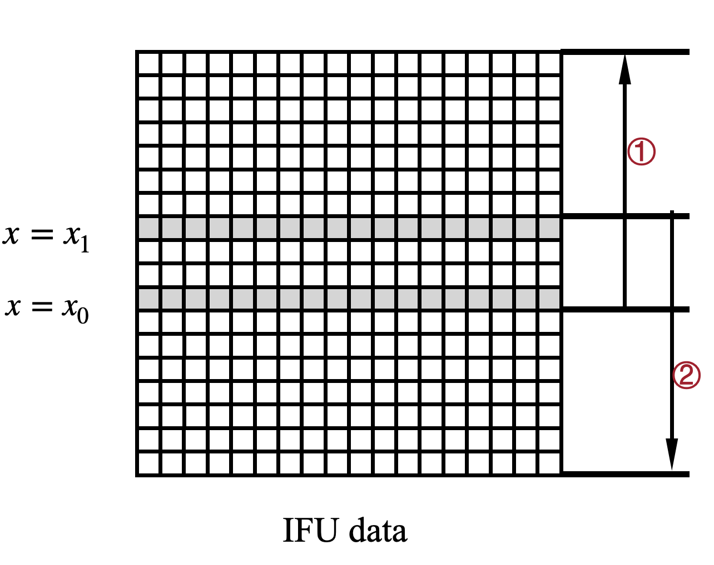

.. include:: include/links.rst

.. highlight:: python
   :linenothreshold: 3

.. _workflow:

ELFO workflow
==============

This section summarizes the fitting strategy employed in the ``process_i_refit`` and ``process_j_refit`` functions of the ELFO package.

User-defined Parameters
-----------------------

- **Fitting start rows**: ``x0``, ``x1`` (correspond to ``i_1`` and ``i_2`` in ``process_i_refit``)
- **Fitting start columns**: ``y0``, ``y1`` (correspond to ``j_1`` and ``j_2`` in ``process_i_refit``)
- **Neighborhood range**: ``k`` (number of nearby pixels to consider, default is 9.  
  This value is hard-coded for simplicity and not exposed as a function parameter.  
  If you need to modify it, you can directly modify the **Elfo** code or contact me for help.)

Fitting Flow
------------

``process_i_refit``
************************

**Fitting procedure when x0 < x1**

``x0`` ---> edge fitting

- Row ``x0`` is fitted with default initial guesses.
- When fitting specific pixels in row ``x0 + 1``, the initial guess for the emission-line fit is taken from the result with the smallest :math:`\chi^2_{\mathrm{red}}` value among the emission-line fits of the ``k`` neighboring pixels in row ``x0``.
- The process repeats until the edge of the data is reached.

``x1``----> ``x = 0`` fitting

- Restarting from row ``x1``
- When fitting specific pixels in row ``x1``, the initial guess for the emission-line fit is taken from the result with the smallest :math:`\chi^2_{\mathrm{red}}` value among the emission-line fits of the ``k`` neighboring pixels in row ``x1 + 1``.
- The process continues by fitting row ``x1 - 1``, and this repeats until reaching row ``0``.

**Fitting procedure when x0 > x1**

``x0`` -----> ``x = 0`` fitting

- Row ``x0`` is fitted with default initial guesses.
- When fitting specific pixels in row ``x0 - 1``, the initial guess for the emission-line fit is taken from the result with the smallest :math:`\chi^2_{\mathrm{red}}` value among the emission-line fits of the ``k`` neighboring pixels in row ``x0``.
- The process repeats until reaching row ``0``.

``x1``----> edge fitting

- Restarting from row ``x1``
- When fitting specific pixels in row ``x1``, the initial guess for the emission-line fit is taken from the result with the smallest :math:`\chi^2_{\mathrm{red}}` value among the emission-line fits of the ``k`` neighboring pixels in row ``x1 - 1``.
- The process continues by fitting row ``x1 + 1``, and this repeats until the edge of the data is reached.

A simple summary of ``process_i_refit`` 's fitting is that it first fits half of the spectra from bottom to top, and then fits the other half from top to bottom. 
The following diagrams illustrates the fitting sequence when ``x0`` < ``x1`` — it might help make things clearer.

    ELFO workflow

    Schematic diagram of the fitting sequence for IFS data. The arrows in the left panel indicate the fitting order: step ① is executed first, followed by step ②.

``process_j_refit``
************************

The fitting procedure is the same as in process_i_refit, 
except that it is applied along the column (``j``) direction instead of the row (``i``) direction.
That is, the spectra are fitted column by column, either from left to right or right to left, 
depending on the relative positions of y0 and y1.
Each pixel is still fitted using the best-fit result (with the lowest :math:`\chi^2_{\mathrm{red}})` 
from its neighboring pixels as the initial guess.

Expected output
-----------------

The function will automatically save the fitting results to the returned path (``path_out``).
For each spectrum, `pyqsofit`_ generates a ``.fits`` file with the fitted parameters and a ``.pdf`` showing the fitting result.
The initial guess for each emission-line fit is derived from the best-fit result of a nearby pixel.

